# Lemmy Know
[](https://hub.docker.com/r/qazcetelic/lemmy-know)

Lemmy Know (*let me know*) is a lightweight CLI application / Docker service that monitors Lemmy for reports on posts and comments and sends notification.
These can be sent to a Discord channel with a webhook or as MQTT messages ([schema](#mqtt-message-schema)), which is useful for more complex setups with e.g., Node-RED.

Reports sometimes don't federate with my main account's instance and I therefore had to check several sites manually each day.
There were also some instance for which the reports didn't seem to federate at all.
This tool is therefore made to check for reports using multiple accounts on multiple instances to avoid this problem.

The Docker image is ~10MB, and the container uses 6MB RAM and ~0.1% CPU on my server.

If you find bugs, have suggestions, or want to contribute features, feel free to open an issue or submit a pull request.

## Usage
The application uses a Postgres database to store credentials, the ID's of the reports which have already been sent, and the full report as a JSONB column in case you want to check something later.

1. Start application to generate [DB tables](#database-schema)
2. Add Lemmy moderator account credentials to table

### Options
When running as CLI application it will use a `.env` file in the current working directory if available.

| CLI Option                | Environment variable | Description                                                |
|---------------------------|----------------------|------------------------------------------------------------|
| `--db-host`               | DB_HOST              | Host of the PostgreSQL database.                           |
| `--db-port`               | DB_PORT              | Port of the PostgreSQL database.                           |
| `--db-user`               | DB_USER              | Username for the PostgreSQL database.                      |
| `--db-password`           | DB_PASSWORD          | Password for the PostgreSQL database.                      |
| `--db-name`               | DB_NAME              | Database name of the PostgreSQL database.                  |
| `-d`, `--discord-webhook` | DISCORD_WEBHOOK      | Optional Discord webhook for notification.                 |
| `--ntfy-host`             | NTFY_HOST            | Host URL for ntfy notifications.                           |
| `--ntfy-topic`            | NTFY_TOPIC           | Topic for ntfy notifications. `lemmy-know` by default.     |
| `--ntfy-username`         | NTFY_USERNAME        | Username for ntfy.                                         |
| `--ntfy-password`         | NTFY_PASSWORD        | Password for ntfy.                                         |
| `--mqtt-host`             | MQTT_HOST            | Host of the MQTT broker.                                   |
| `--mqtt-port`             | MQTT_PORT            | Port of the MQTT broker.                                   |
| `--mqtt-user`             | MQTT_USER            | Username for the MQTT broker.                              |
| `--mqtt-password`         | MQTT_PASSWORD        | Password for the MQTT broker.                              |
| `-i`, `--interval`        | INTERVAL             | Interval in seconds to send requests to check for reports. |

## Database Schema

```mermaid
classDiagram
direction BT
class comment_reports {
    🔑 text domain
    🔑 integer id
    jsonb data
}
class credentials {
    🔑 text domain
    🔑 text username
    text password
}
class post_reports {
    🔑 text domain
    🔑 integer id
    jsonb data
}


```



## MQTT message schema

### Comment
Topic: `lemmy-know/comment`
```json
{
  "source_domain": STRING,
  "report": {
    "comment_report": {
      "id": NUMBER,
      "creator_id": NUMBER,
      "comment_id": NUMBER,
      "original_comment_text": STRING,
      "reason": STRING,
      "resolved": BOOLEAN,
      "published": TIMESTAMP
    },
    "comment": {
      "id": NUMBER,
      "creator_id": NUMBER,
      "post_id": NUMBER,
      "content": STRING,
      "removed": BOOLEAN,
      "published": TIMESTAMP,
      "deleted": BOOLEAN,
      "ap_id": STRING,
      "local": BOOLEAN,
      "path": STRING,
      "distinguished": BOOLEAN,
      "language_id": NUMBER
    },
    "post": {
      "id": NUMBER,
      "name": STRING,
      "url": STRING,
      "body": STRING,
      "creator_id": NUMBER,
      "community_id": NUMBER,
      "removed": BOOLEAN,
      "locked": BOOLEAN,
      "published": TIMESTAMP,
      "updated": TIMESTAMP,
      "deleted": BOOLEAN,
      "nsfw": BOOLEAN,
      "thumbnail_url": STRING,
      "ap_id": STRING,
      "local": BOOLEAN,
      "language_id": NUMBER,
      "featured_community": BOOLEAN,
      "featured_local": BOOLEAN,
      "url_content_type": STRING
    },
    "community": {
      "id": NUMBER,
      "name": STRING,
      "title": STRING,
      "description": STRING,
      "removed": BOOLEAN,
      "published": TIMESTAMP,
      "updated": TIMESTAMP,
      "deleted": BOOLEAN,
      "nsfw": BOOLEAN,
      "actor_id": STRING,
      "local": BOOLEAN,
      "icon": STRING,
      "banner": STRING,
      "hidden": BOOLEAN,
      "posting_restricted_to_mods": BOOLEAN,
      "instance_id": NUMBER,
      "visibility": STRING
    },
    "creator": {
      "id": NUMBER,
      "name": STRING,
      "display_name": STRING,
      "banned": BOOLEAN,
      "published": TIMESTAMP,
      "actor_id": STRING,
      "bio": STRING,
      "local": BOOLEAN,
      "deleted": BOOLEAN,
      "matrix_user_id": STRING,
      "bot_account": BOOLEAN,
      "instance_id": NUMBER
    },
    "comment_creator": {
      "id": NUMBER,
      "name": STRING,
      "banned": BOOLEAN,
      "published": TIMESTAMP,
      "actor_id": STRING,
      "local": BOOLEAN,
      "deleted": BOOLEAN,
      "bot_account": BOOLEAN,
      "instance_id": NUMBER
    },
    "counts": {
      "comment_id": NUMBER,
      "score": NUMBER,
      "upvotes": NUMBER,
      "downvotes": NUMBER,
      "published": TIMESTAMP,
      "child_count": NUMBER
    },
    "creator_banned_from_community": BOOLEAN,
    "creator_is_moderator": BOOLEAN,
    "creator_is_admin": BOOLEAN,
    "creator_blocked": BOOLEAN,
    "subscribed": STRING,
    "saved": BOOLEAN
  }
}
```

### Post
Topic: `lemmy-know/post`
```json
{
  "source_domain": STRING,
  "report": {
    "post_report": {
      "id": NUMBER,
      "creator_id": NUMBER,
      "post_id": NUMBER,
      "original_post_name": STRING,
      "original_post_url": STRING,
      "reason": STRING,
      "resolved": BOOLEAN,
      "published": TIMESTAMP
    },
    "post": {
      "id": NUMBER,
      "name": STRING,
      "url": STRING,
      "creator_id": NUMBER,
      "community_id": NUMBER,
      "removed": BOOLEAN,
      "locked": BOOLEAN,
      "published": TIMESTAMP,
      "deleted": BOOLEAN,
      "nsfw": BOOLEAN,
      "thumbnail_url": STRING,
      "ap_id": STRING,
      "local": BOOLEAN,
      "language_id": NUMBER,
      "featured_community": BOOLEAN,
      "featured_local": BOOLEAN,
      "url_content_type": STRING
    },
    "community": {
      "id": NUMBER,
      "name": STRING,
      "title": STRING,
      "description": STRING,
      "removed": BOOLEAN,
      "published": TIMESTAMP,
      "updated": TIMESTAMP,
      "deleted": BOOLEAN,
      "nsfw": BOOLEAN,
      "actor_id": STRING,
      "local": BOOLEAN,
      "icon": STRING,
      "banner": STRING,
      "hidden": BOOLEAN,
      "posting_restricted_to_mods": BOOLEAN,
      "instance_id": NUMBER,
      "visibility": STRING
    },
    "creator": {
      "id": NUMBER,
      "name": STRING,
      "display_name": STRING,
      "banned": BOOLEAN,
      "published": TIMESTAMP,
      "actor_id": STRING,
      "bio": STRING,
      "local": BOOLEAN,
      "deleted": BOOLEAN,
      "matrix_user_id": STRING,
      "bot_account": BOOLEAN,
      "instance_id": NUMBER
    },
    "post_creator": {
      "id": NUMBER,
      "name": STRING,
      "banned": BOOLEAN,
      "published": TIMESTAMP,
      "actor_id": STRING,
      "local": BOOLEAN,
      "deleted": BOOLEAN,
      "bot_account": BOOLEAN,
      "instance_id": NUMBER
    },
    "creator_banned_from_community": BOOLEAN,
    "creator_is_moderator": BOOLEAN,
    "creator_is_admin": BOOLEAN,
    "subscribed": STRING,
    "saved": BOOLEAN,
    "read": BOOLEAN,
    "hidden": BOOLEAN,
    "creator_blocked": BOOLEAN,
    "unread_comments": NUMBER,
    "counts": {
      "post_id": NUMBER,
      "comments": NUMBER,
      "score": NUMBER,
      "upvotes": NUMBER,
      "downvotes": NUMBER,
      "published": TIMESTAMP,
      "newest_comment_time": TIMESTAMP
    }
  }
}
```
